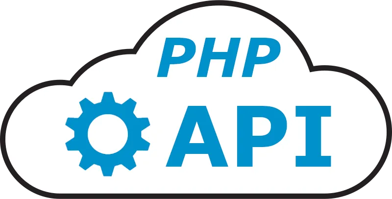

# API REST con PHP

## Descripción

Esta API REST utiliza PHP puro para gestionar operaciones CRUD sobre pedidos de cursos y clientes.

## Rutas de la API

### GET /

- Despliega un mensaje indicando que no se ha encontrado la ruta solicitada.

### GET /cursos

- Devuelve una lista de cursos con paginación (opcional).
- Párametros:
- `pagina`: Número de página (opcional).

### POST /cursos

- Crea un nuevo curso.
- Request Body:
- `titulo`: Título del curso.
- `descripcion`: Descripción del curso.
- `instructor`: Instructor del curso.
- `imagen`: Imagen del curso.
- `precio`: Precio del curso.

### GET /cursos/{id}

- Devuelve un curso con el ID especificado.

### PUT /cursos/{id}

- Actualiza un curso con el ID especificado.
- Request Body:
- `titulo`: Título del curso.
- `descripcion`: Descripción del curso.
- `instructor`: Instructor del curso.
- `imagen`: Imagen del curso.
- `precio`: Precio del curso.

### DELETE /cursos/{id}

- Elimina un curso con el ID especificado.

### GET /registro

- Devuelve un mensaje de bienvenida.

### POST /registro

- Crea un nuevo cliente.
- Request Body:
- `nombre`: Nombre del cliente.
- `apellido`: Apellido del cliente.
- `email`: Correo electrónico del cliente.

++------------------++
| Pusho.Devs | Coder |
+--------------------+
pushodevs@gmail.com | https://github.com/PushoDev
